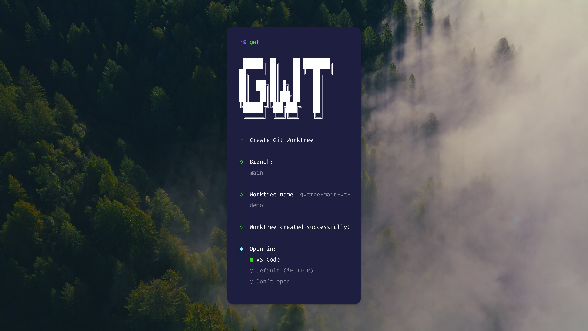

<div align="center">



# GWTree

**Git worktree manager for parallel development**

[](https://github.com/ahmadawais/gwtree)
[](https://github.com/ahmadawais/gwtree)
[](LICENSE)

<br />

Create and manage git worktrees effortlessly.  
Perfect for running multiple coding agents in parallel on different branches.

<br />

</div>

---

<br />

## Installation

- Download the binary from the releases page
- Move the binary into any folder in your path for e.g. `~/.local/bin/`
- If you have issues with mac not recognising this due to lack of signing, run the following command: `xattr -dr com.apple.quarantine <path-to-binary>/gwt`

<br />

## Usage

### Create Worktree

```bash
gwtree
```

Interactive prompts guide you through:

1. **Branch** — Select main/master, use an existing branch, or create new branch
2. **Worktree name** — Quick edit suffix or press ESC for full customization
3. **Open in** — Choose VS Code, default editor, or skip

<br />

### List & Delete Worktrees

```bash
gwtree list
```

Browse and delete worktrees interactively with arrow keys and search.

<br />

### Remove Worktree

```bash
gwtree remove
```

<br />

### Non-Interactive / CLI Mode

All commands support CLI flags for scripting, CI, and automation. When sufficient flags are provided, interactive prompts are skipped.

#### Create

```bash
# Fully non-interactive
gwtree create --branch main --suffix 2 --no-editor

# Existing branch, direct checkout
gwtree create --branch feat-login --suffix 1 --no-editor

# New branch, open in VS Code
gwtree create --branch feat-login --new-branch --suffix 1 --editor code

# Custom worktree name
gwtree create --branch main --name my-worktree --no-editor

# Partial flags — prompts only for missing values
gwtree create --branch main
```

| Flag                | Description                                                |
| ------------------- | ---------------------------------------------------------- |
| `--branch <name>`   | Branch to checkout directly (if exists) or create (if not) |
| `--new-branch`      | Create the branch instead of using existing                |
| `--name <name>`     | Worktree directory name (skips pattern)                    |
| `--suffix <suffix>` | Suffix for name pattern (uses config `namePattern`)        |
| `--editor <editor>` | Editor to open: `code` \| `default` \| `none`              |
| `--no-editor`       | Shorthand for `--editor none`                              |

#### List

```bash
# JSON output for scripting
gwtree list --json
gwtree list --json | jq '.[].branch'
```

| Flag     | Description                  |
| -------- | ---------------------------- |
| `--json` | Output worktree list as JSON |

#### Remove

```bash
# Remove by path, name, or branch
gwtree rm /path/to/worktree --force
gwtree rm my-worktree --force
gwtree rm feat-login --force

# Remove worktree and delete the branch
gwtree rm feat-login --force --delete-branch
```

| Flag              | Description                                   |
| ----------------- | --------------------------------------------- |
| `[path]`          | Worktree path, directory name, or branch name |
| `--force`         | Skip confirmation, force-remove if needed     |
| `--delete-branch` | Also delete the associated local git branch   |

<br />

---

<br />

## Features

**Quick worktree creation**  
Minimal prompts, smart defaults

**Smart naming**  
Pattern: `{repo}-{branch}-wt-{suffix}`

**Interactive management**  
List, search, and delete worktrees

**Configurable defaults**  
Customize via `.gwtreerc.json` in your project

**Automation hooks**  
Copy files and run commands on worktree creation

**Clean UX**  
Dimmed prefixes, ESC for full control

**Auto branch creation**
Unique branch names for each worktree

**Non-interactive CLI mode**
CLI flags for scripting, CI, and automation

<br />

---

<br />

## Configuration

GWTree uses a project-level configuration file discovered by walking up from the current directory to your home directory (like gitconfig). The first matching file wins.

### Project Configuration

Create a configuration file anywhere in your project hierarchy:

**Searched filenames (in order):**

- `.gwtreerc`
- `gwtree.json`
- `.gwtree.json`

**Example (`gwtree.json`):**

```json
{
  "defaultBranchChoice": "current",
  "defaultSuffix": "1",
  "defaultEditor": "code",
  "namePattern": "{repo}-{branch}-wt-{suffix}"
}
```

### Available Options

| Option                | Type                                | Default                         | Description              |
| --------------------- | ----------------------------------- | ------------------------------- | ------------------------ |
| `defaultBranchChoice` | `"current"` \| `"new"`              | `"current"`                     | Default branch selection |
| `defaultSuffix`       | `string`                            | `"1"`                           | Default worktree suffix  |
| `defaultOpenEditor`   | `boolean`                           | `true`                          | Prompt to open editor    |
| `defaultEditor`       | `"code"` \| `"default"` \| `"none"` | `"code"`                        | Default editor choice    |
| `namePattern`         | `string`                            | `"{repo}-{branch}-wt-{suffix}"` | Worktree naming pattern  |

<br />

---

<br />

## Hooks

Automate tasks when creating worktrees with the `onCreate` hook:

### Copy Files

Copy files or directories from your main worktree to newly created worktrees:

```json
{
  "hooks": {
    "onCreate": {
      "copyFiles": [
        { "src": ".env", "dst": "." },
        { "src": "root/.env.local", "dst": "." },
        { "src": "config", "dst": "config" }
      ]
    }
  }
}
```

**Path resolution:**

- `src`: Path relative to git root (optional `root/` prefix)
- `dst`: Path relative to new worktree (`.` copies to root)

### Run Commands

Execute commands in the newly created worktree:

```json
{
  "hooks": {
    "onCreate": {
      "runCommands": ["npm install", "echo 'Setup complete for {branchName}'"]
    }
  }
}
```

**Variables:**

- `{worktreePath}` - Full path to new worktree
- `{branchName}` - Branch name

### Complete Example

Combine file copying and command execution:

```json
{
  "defaultEditor": "code",
  "hooks": {
    "onCreate": {
      "copyFiles": [
        { "src": ".env", "dst": "." },
        { "src": "node_modules", "dst": "." }
      ],
      "runCommands": [
        "npm install",
        "npm run build",
        "echo 'Worktree {branchName} ready!'"
      ]
    }
  }
}
```

**Execution order:**

1. Worktree created
2. Files/directories copied (`copyFiles`)
3. Commands executed (`runCommands`)
4. Editor opened (if configured)

<br />

---

<br />

## Commands

| Command         | Alias       | Description               |
| --------------- | ----------- | ------------------------- |
| `gwtree`        | `gwt`       | Create new worktree       |
| `gwtree list`   | `gwt ls`    | List and manage worktrees |
| `gwtree remove` | `gwt rm`    | Remove a worktree         |
| `gwtree -v`     | `--version` | Show version              |
| `gwtree -h`     | `--help`    | Show help                 |

<br />

---

<br />

## Why GWTree?

Perfect for parallel development workflows:

- Run Command Code, Claude and Codex simultaneously on different features
- Test changes across multiple branches
- Keep main branch clean while experimenting
- Quick context switching without stashing

<br />

---

<br />

<div align="center">

**MIT License** © 2025 [Ahmad Awais](https://x.com/_AhmadAwais)

</div>
